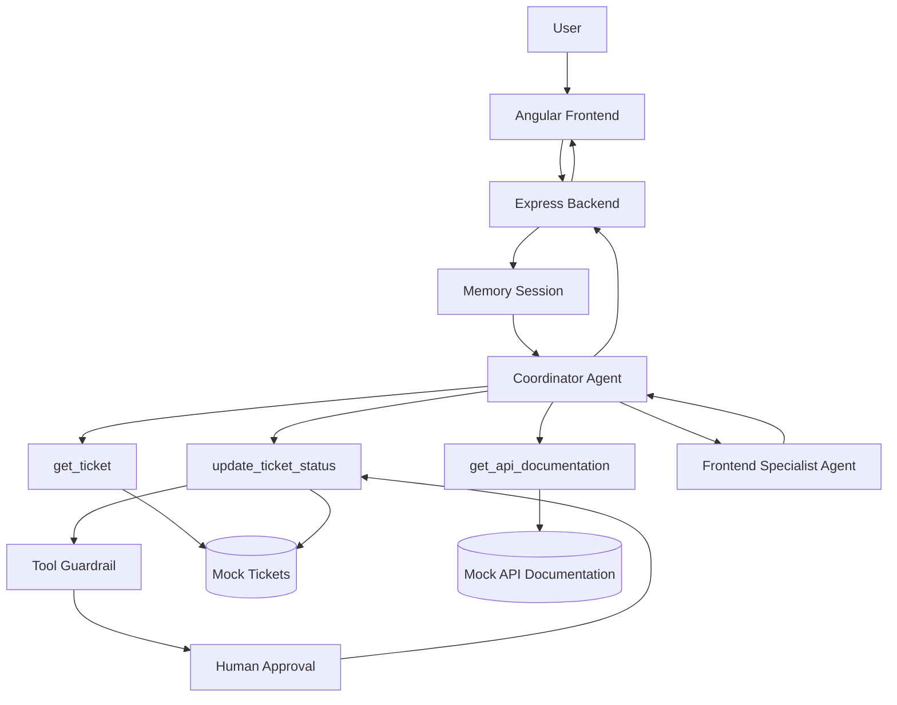

# AI Agents Lab

A proof-of-concept application for exploring and demonstrating AI Agents, tools, sub-agents, conversation sessions, guardrails and human-in-the-loop workflows in a software development context.

The project demonstrates how an AI agent can interact with internal application data and capabilities instead of behaving only as a traditional chatbot.

---

# Project Goal

The goal of this project is to research and practically demonstrate the core concepts behind AI Agents and Sub-Agents.

The application focuses on several important agent concepts:

- AI Agents
- Agent instructions
- Function tools
- Tool selection
- Multi-step agent workflows
- Sub-agents
- Agent-as-Tool orchestration
- Conversation sessions
- Tool guardrails
- Human-in-the-loop approval
- Tracing and observability

The project is intentionally implemented as a small internal developer assistant rather than a production application.

---

# Main Scenario

The application simulates an internal development environment containing:

- Development tickets
- Internal API documentation
- An AI Coordinator Agent
- A Frontend Specialist Sub-Agent

A developer can ask natural-language questions such as:

```text
What are the requirements of DEV-101?
```

The Coordinator Agent can decide to use the internal ticket tool.

A more complex request:

```text
Analyze DEV-101 and give me a detailed Angular frontend implementation plan.
```

can produce the following workflow:

```text
User
 ↓
Coordinator Agent
 ↓
get_ticket
 ↓
DEV-101
 ↓
relatedApi = Locations
 ↓
get_api_documentation
 ↓
Locations API
 ↓
Frontend Specialist Agent
 ↓
Coordinator Agent
 ↓
Final response
```

The application also contains a write operation:

```text
Change DEV-102 status to IN_PROGRESS.
```

which demonstrates guardrails and human approval.

---

# Architecture



---

# Technology Stack

## Frontend

- Angular
- TypeScript
- Standalone Components
- Signals
- Angular Router
- Angular HttpClient
- SCSS

## Backend

- Node.js
- TypeScript
- Express
- OpenAI Agents SDK
- Zod
- dotenv
- CORS

## AI

- OpenAI Agents SDK
- Coordinator Agent
- Function Tools
- Agent-as-Tool
- Memory Sessions
- Tool Guardrails
- Human Approval
- Tracing

---

# Core Agent Concepts

## Coordinator Agent

The Coordinator Agent is the main agent in the application.

Its responsibilities include:

- Understanding the developer request
- Determining whether internal information is required
- Selecting the correct tool
- Combining information from multiple tools
- Delegating frontend analysis to a specialist
- Coordinating write operations
- Returning the final response to the user

The Coordinator Agent should not invent internal ticket or API information.

If the required information is unavailable or ambiguous, it should ask for clarification.

---

# Function Tools

Tools allow the agent to interact with application capabilities and internal data.

The project currently contains three function tools.

## get_ticket

Retrieves information about a development ticket.

Example:

```text
User:
What are the requirements of DEV-101?

Coordinator Agent
 ↓
get_ticket("DEV-101")
 ↓
Ticket data
 ↓
Final response
```

The tool reads from the mock ticket dataset.

---

## get_api_documentation

Retrieves internal API documentation for a known API resource.

Example:

```text
User:
What endpoints are available in the Locations API?

Coordinator Agent
 ↓
get_api_documentation("Locations")
 ↓
API documentation
 ↓
Final response
```

---

## update_ticket_status

Updates the status of an existing development ticket.

Unlike the read-only tools, this tool modifies application state.

Because the tool has a side effect, it is protected by:

```text
Zod validation
 ↓
Tool Guardrail
 ↓
Human Approval
 ↓
Tool execution
```

The tool is not allowed to execute immediately after the agent requests it.

---

# Sub-Agent

The project contains a specialized:

```text
Frontend Specialist Agent
```

Its responsibility is to analyze already collected requirements and API information and produce practical Angular implementation guidance.

The specialist may suggest:

- Components
- Services
- TypeScript models
- API calls
- State handling
- Loading states
- Error handling
- Validation
- Pagination
- Filters

The Frontend Specialist does not retrieve internal ticket data itself.

Instead:

```text
Coordinator Agent
 ↓
collects ticket + API information
 ↓
Frontend Specialist
 ↓
performs specialized reasoning
 ↓
Coordinator Agent
 ↓
final response
```

The specialist is exposed to the Coordinator using the Agent-as-Tool pattern.

---

# Agent-as-Tool Pattern

The project uses a manager-style multi-agent architecture.

The Coordinator Agent remains responsible for the user interaction.

The Frontend Specialist is invoked as a tool:

```text
User
 ↓
Coordinator
 ↓
Frontend Specialist
 ↓
Coordinator
 ↓
User
```

This is different from a handoff.

With Agent-as-Tool, the Coordinator keeps control of the workflow.

---

# Multi-Step Agent Workflow

One of the primary demonstrations of the project is that the developer does not need to manually specify each technical step.

For example:

```text
Analyze DEV-101 and give me an Angular implementation plan.
```

The agent can determine that it needs:

```text
1. Ticket information
2. Related API information
3. Frontend specialist analysis
```

The application does not contain code such as:

```ts
if (message.includes('DEV-101')) {
  callTicketApi();
  callLocationsApi();
  callFrontendAgent();
}
```

Instead, the model selects the appropriate tools based on:

- Agent instructions
- Tool names
- Tool descriptions
- Current conversation context

---

# Conversation Sessions

The application supports multi-turn conversations.

Example:

```text
User:
Tell me about DEV-102.

Assistant:
...

User:
Which API does it use?
```

The second message does not explicitly contain:

```text
DEV-102
```

but the agent can resolve the reference using the existing conversation session.

The frontend receives a:

```text
conversationId
```

and sends it with subsequent requests.

The backend maps that conversation to a Memory Session.

Conceptually:

```text
conversationId
 ↓
MemorySession
 ↓
Conversation history
 ↓
Coordinator Agent
```

---

# New Chat

The user can start a new conversation from the frontend.

The frontend calls:

```text
DELETE /api/ai/conversations/:conversationId
```

The backend clears the associated session.

After starting a new chat, previous conversation context should no longer be available.

For example:

```text
New chat

User:
Which API does it use?
```

should result in a clarification request because no referenced ticket exists in the new conversation.

---

# Guardrails

The project demonstrates tool-level guardrails.

The `update_ticket_status` tool cannot perform arbitrary status transitions.

Valid transitions are:

```text
OPEN
 ↓
IN_PROGRESS
 ↓
DONE
```

Examples:

```text
OPEN → IN_PROGRESS        allowed

IN_PROGRESS → DONE        allowed

OPEN → DONE               rejected

DONE → OPEN               rejected

DONE → IN_PROGRESS        rejected
```

This validation is deterministic TypeScript logic.

The language model cannot decide to bypass the rule.

---

# Validation vs Guardrails

Several different validation layers are demonstrated.

## Agent Instructions

Example:

```text
Only use update_ticket_status when the user explicitly requests a status change.
```

Instructions influence model behavior.

They should not be considered a security boundary.

---

## Zod Schema

Example:

```text
status must be one of:

OPEN
IN_PROGRESS
DONE
```

This protects the structure of tool arguments.

---

## Tool Guardrail

Example:

```text
OPEN → DONE
```

may contain valid input values but still violates a business rule.

The guardrail detects this.

---

## Human Approval

Even if an action is technically valid, the user may still decide whether it should execute.

Example:

```text
OPEN → IN_PROGRESS
```

is valid.

The application still pauses and asks:

```text
Approve
or
Reject
```

---

# Human-in-the-Loop

The write tool uses human approval.

Example workflow:

```text
User:
Change DEV-102 status to IN_PROGRESS.

 ↓

Coordinator Agent requests:

update_ticket_status

 ↓

Guardrail validates:

OPEN → IN_PROGRESS

 ↓

Run pauses

 ↓

Frontend displays:

Human approval required

[Reject] [Approve]

 ↓
```

If the user selects:

```text
Reject
```

the operation does not execute.

If the user selects:

```text
Approve
```

the paused Agent RunState is resumed and the tool executes.

This allows the agent to propose actions while the human retains control over side effects.

---

# Tracing

The project uses tracing to inspect Agent workflows.

Tracing helps visualize operations such as:

```text
Agent execution
Model generation
Tool calls
Guardrails
Nested agent execution
```

A complex request can therefore be inspected as a complete workflow instead of only observing the final response.

Example:

```text
Coordinator
 ↓
get_ticket
 ↓
Coordinator
 ↓
get_api_documentation
 ↓
Coordinator
 ↓
frontend_specialist
 ↓
Coordinator
 ↓
Final response
```

Local console logging is also intentionally kept for demonstration purposes.

Example:

```text
[TOOL] get_ticket called with ticketId=DEV-101

[TOOL] get_api_documentation called with resource=Locations

[TOOL] update_ticket_status executing: DEV-102 -> IN_PROGRESS
```

---

# Backend Project Structure

```text
backend/
├── ai-tests-http/
│
├── src/
│   ├── ai/
│   │   ├── agents/
│   │   │   ├── specialists/
│   │   │   │   └── frontend-specialist.agent.ts
│   │   │   └── assistant.agent.ts
│   │   │
│   │   ├── guardrails/
│   │   │   └── update-ticket-status.guardrail.ts
│   │   │
│   │   ├── models/
│   │   │   └── ai-result.model.ts
│   │   │
│   │   ├── services/
│   │   │   ├── ai.service.ts
│   │   │   ├── approval.service.ts
│   │   │   └── session.service.ts
│   │   │
│   │   └── tools/
│   │       ├── get-ticket.tool.ts
│   │       ├── get-api-documentation.tool.ts
│   │       └── update-ticket-status.tool.ts
│   │
│   ├── config/
│   │   └── env.ts
│   │
│   ├── data/
│   │   ├── tickets.data.ts
│   │   └── api-documentation.data.ts
│   │
│   ├── models/
│   │   ├── ticket.model.ts
│   │   └── api-documentation.model.ts
│   │
│   ├── routes/
│   │   ├── ai.routes.ts
│   │   ├── tickets.routes.ts
│   │   └── api-documentation.routes.ts
│   │
│   └── server.ts
│
├── .env
├── .env.example
├── package.json
└── tsconfig.json
```

---

# Frontend Project Structure

```text
frontend/
└── src/
    └── app/
        ├── core/
        │
        ├── features/
        │   ├── tickets/
        │   │   ├── data-access/
        │   │   ├── models/
        │   │   └── pages/
        │   │
        │   ├── api-docs/
        │   │   ├── data-access/
        │   │   ├── models/
        │   │   └── pages/
        │   │
        │   └── agent-playground/
        │       ├── data-access/
        │       ├── models/
        │       └── pages/
        │
        ├── app.ts
        ├── app.html
        ├── app.scss
        ├── app.config.ts
        └── app.routes.ts
```

---

# Application Pages

## Tickets

Route:

```text
/tickets
```

Provides a visual representation of mock development tickets.

The page allows developers to inspect:

- Ticket ID
- Status
- Description
- Requirements
- Related API

---

## API Documentation

Route:

```text
/api-docs
```

Provides internal mock API documentation.

The page displays:

- API resources
- Endpoints
- HTTP methods
- Endpoint descriptions
- Request examples
- Response examples

---

## AI Playground

Route:

```text
/agent
```

The main AI Agent interface.

Features include:

- Multi-turn conversations
- Session context
- Tool usage
- Sub-agent delegation
- Loading states
- Human approval UI
- New conversation functionality

---

# Backend API

## Health

```http
GET /api/health
```

Example response:

```json
{
  "status": "ok",
  "service": "agent-lab-backend"
}
```

---

## Tickets

```http
GET /api/tickets
```

Returns all tickets.

```http
GET /api/tickets/:id
```

Returns a specific ticket.

---

## API Documentation

```http
GET /api/docs
```

Returns all API documentation.

```http
GET /api/docs/:resource
```

Returns documentation for a specific resource.

---

## AI Chat

```http
POST /api/ai/chat
```

Example:

```json
{
  "message": "Analyze DEV-101.",
  "conversationId": "optional-existing-conversation-id"
}
```

A normal response:

```json
{
  "status": "completed",
  "answer": "...",
  "conversationId": "..."
}
```

An action requiring approval may return:

```json
{
  "status": "approval_required",
  "approvalId": "...",
  "toolName": "update_ticket_status",
  "arguments": "{\"ticketId\":\"DEV-102\",\"status\":\"IN_PROGRESS\"}",
  "conversationId": "..."
}
```

---

## Approval

```http
POST /api/ai/approvals/:approvalId
```

Approve:

```json
{
  "approved": true
}
```

Reject:

```json
{
  "approved": false
}
```

---

## Conversation

```http
DELETE /api/ai/conversations/:conversationId
```

Clears a conversation session.

---

# Environment Configuration

Create:

```text
backend/.env
```

based on:

```text
backend/.env.example
```

Example:

```env
OPENAI_API_KEY=
PORT=3000
CORS_ORIGIN=http://localhost:4200
```

The real `.env` file must never be committed to Git.

---

# Installation

Clone the repository.

Then install backend dependencies.

```bash
cd backend

npm install
```

Install frontend dependencies.

```bash
cd ../frontend

npm install
```

---

# Running the Application

Two terminals are required.

## Backend

```bash
cd backend

npm run dev
```

Expected:

```text
Backend running on http://localhost:3000
```

---

## Frontend

```bash
cd frontend

npm start
```

Open:

```text
http://localhost:4200
```

---

# Corporate TLS / Certificate Environment

Some corporate networks use HTTPS inspection with an internal certificate authority.

If Node reports:

```text
UNABLE_TO_GET_ISSUER_CERT_LOCALLY
```

the project may need Node to use the operating system certificate store.

The development script can be configured with:

```text
NODE_USE_SYSTEM_CA=1
```

For example with `cross-env`:

```json
{
  "scripts": {
    "dev": "cross-env NODE_USE_SYSTEM_CA=1 tsx watch src/server.ts"
  }
}
```

This configuration is environment-specific and may not be required outside corporate networks.

Do not disable TLS certificate verification.

---

# Building

## Backend

```bash
cd backend

npm run build
```

---

## Frontend

```bash
cd frontend

npm run build
```

Both builds should complete without TypeScript errors before committing significant changes.

---

# Recommended Demo Scenario

For a short project demonstration, use the following sequence.

## 1. Simple Agent

```text
Explain Angular dependency injection in two sentences.
```

Demonstrates:

```text
Agent
without tools
```

---

## 2. Tool Usage

```text
What are the requirements of DEV-101?
```

Demonstrates:

```text
get_ticket
```

---

## 3. API Tool

```text
What endpoints are available in the Locations API?
```

Demonstrates:

```text
get_api_documentation
```

---

## 4. Multi-Step + Sub-Agent

```text
Analyze DEV-101 and give me a detailed Angular frontend implementation plan.
```

Demonstrates:

```text
Coordinator
 ↓
Ticket tool
 ↓
API tool
 ↓
Frontend Specialist
 ↓
Final answer
```

---

## 5. Session Context

```text
Tell me about DEV-102.
```

Then:

```text
Which API does it use?
```

Demonstrates conversation memory.

Start a New Chat and ask:

```text
Which API does it use?
```

The agent should now ask for clarification.

---

## 6. Guardrail

With DEV-102 in OPEN state:

```text
Change DEV-102 status to DONE.
```

Expected:

```text
Guardrail rejection
```

No approval should be displayed.

---

## 7. Human Approval

```text
Change DEV-102 status to IN_PROGRESS.
```

Expected:

```text
Approval card
```

Demonstrate both:

```text
Reject
```

and:

```text
Approve
```

---

# Functional Testing

Detailed acceptance tests should be kept in:

```text
TESTING.md
```

The recommended mandatory scenarios are:

```text
Test 1
Agent without tools

Test 2
Ticket retrieval

Test 3
API documentation retrieval

Test 4
Multi-step workflow + Sub-Agent

Test 5
Conversation session/context

Test 6
Guardrail rejection

Test 7
Human approval / Reject

Test 8
Human approval / Approve
```

Additional tests can verify ticket status transition rules.

---

# Current Mock Data

The project intentionally uses mock application data.

This keeps the proof of concept focused on Agent architecture rather than external integrations.

Current internal resources include:

```text
Tickets

DEV-101
DEV-102
DEV-103
```

and API documentation for resources such as:

```text
Locations
Events
Users
```

---

# Known Limitations

This project is a proof of concept.

Current limitations include:

### In-memory data

Ticket changes are not persisted to a database.

Restarting the backend resets mock data.

---

### In-memory sessions

Conversation sessions use memory-based storage.

Restarting the backend removes existing conversations.

---

### In-memory approvals

Pending approval RunStates are stored in backend memory.

Restarting the server removes pending approval requests.

---

### No authentication

The application does not currently authenticate users.

A production system would need authorization rules around internal data and write operations.

---

### Mock internal systems

Tickets and API documentation are local mock datasets.

A real implementation could integrate with systems such as:

```text
Jira
GitLab
GitHub
Internal APIs
Documentation platforms
Databases
```

---

# Production Considerations

A production implementation would likely require:

- Persistent session storage
- Persistent approval state
- Database integration
- Authentication
- Authorization
- Audit logging
- Secret management
- Rate limiting
- Structured application logging
- More extensive guardrails
- Automated evaluations
- Monitoring
- Production error handling

Critical business authorization should also exist in the application/domain layer and should not rely only on LLM instructions or Agent guardrails.

---

# Possible Future Improvements

The project could later be expanded with:

```text
Backend Specialist Agent

Documentation Specialist Agent

Automated test generation

Jira integration

GitLab integration

Code repository analysis

Persistent conversations

Redis session storage

Database persistence

Streaming responses

MCP integrations

Automated Agent evaluations

Role-based access control
```

These improvements are intentionally outside the current PoC scope.

---

# What This PoC Demonstrates

The project demonstrates the difference between a basic chatbot and an Agent-based application.

A traditional LLM request can be represented as:

```text
Prompt
 ↓
LLM
 ↓
Response
```

This project instead demonstrates:

```text
Natural-language request
 ↓
Coordinator Agent
 ↓
Reasoning
 ↓
Tool selection
 ↓
Internal data
 ↓
Optional Sub-Agent
 ↓
Guardrails
 ↓
Optional Human Approval
 ↓
Application action
 ↓
Final response
```

The main value is not simply generating text.

The Agent can decide which available application capability is required, collect information from multiple sources, delegate specialized reasoning, maintain conversation context and safely coordinate actions.

---

# Project Status

Current status:

```text
Proof of Concept — Complete
```

Implemented concepts:

- [x] AI Agent
- [x] Agent instructions
- [x] Function tools
- [x] Multiple tools
- [x] Multi-step agent loop
- [x] Sub-Agent
- [x] Agent-as-Tool orchestration
- [x] Conversation sessions
- [x] Tool guardrails
- [x] Human-in-the-loop approval
- [x] Tracing
- [x] Angular user interface
- [x] Read operations
- [x] Write operation
- [x] Functional test scenarios

---

# Conclusion

AI Agents extend traditional LLM applications by combining language-model reasoning with application tools, internal context and controlled actions.

This proof of concept demonstrates how an Agent can be used in a software-development environment to:

- Understand development requests
- Retrieve internal information
- Combine information from multiple systems
- Delegate work to specialized agents
- Maintain conversational context
- Validate actions through deterministic rules
- Require human approval for side effects
- Execute controlled application operations

The project provides a practical foundation for evaluating where Agent-based workflows could be useful in real internal development processes.